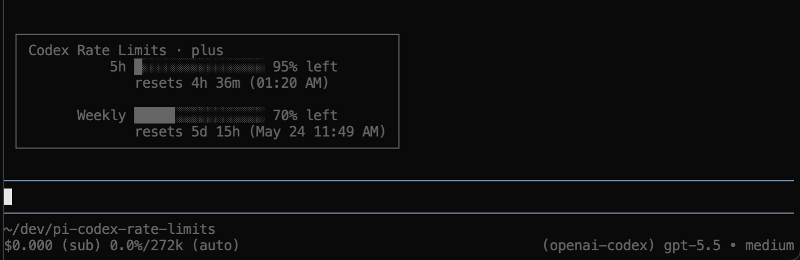

# pi-codex-rate-limits

See your rate limits from your Codex subscription in [pi](https://pi.dev/).



## Install

```
pi install npm:@scnewma/pi-codex-rate-limits
```

## Usage

```
/codex-rate-limits
```
